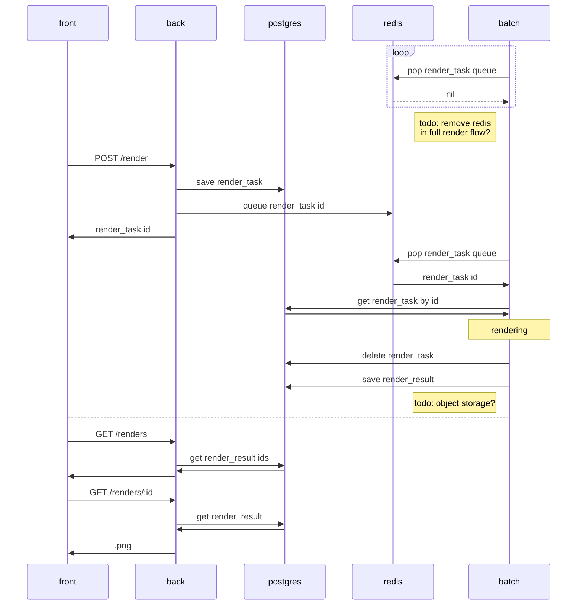
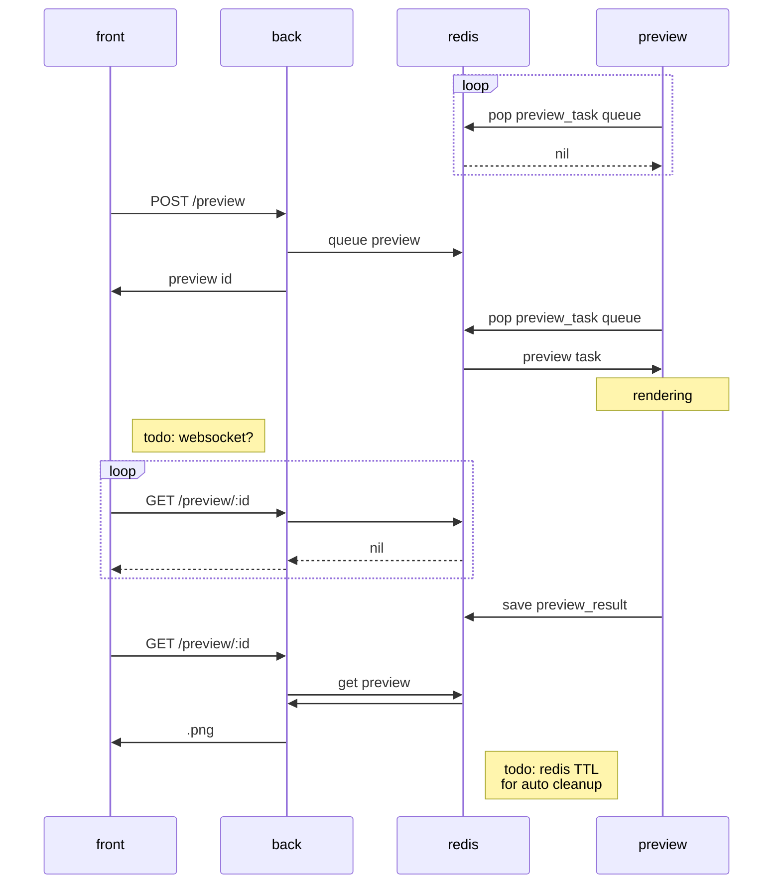

# clovers-service

Frontend + Backend + Batch for [clovers](https://github.com/walther/clovers), the raytracing renderer.

## clovers-front

Web frontend service, user-facing interface for the application. Written in Typescript using React with [create-react-app](https://github.com/facebook/create-react-app/).

## clovers-back

Web backend service, handles API requests. Written in Rust using [axum](https://github.com/tokio-rs/axum).

## clovers-batch

Batch processing service, handles offline rendering of longer tasks with a high amount of resources available. Written in Rust using [axum](https://github.com/tokio-rs/axum).

## clovers-preview

Preview processing service, handles near-realtime rendering for web UI purposes. Written in Rust using [axum](https://github.com/tokio-rs/axum).

## postgres

Main database for the service. Persistent data.

## redis

Queue service for the preview rendering tasks and results. Ephemeral data.

## Usage

Note: first time build times will be slow.

- Development mode: `just dev`
- Production mode: `just prod`

In development mode, hot reload will be available for all services.

## Sequence diagrams

### Full render flow

### Preview render flow

