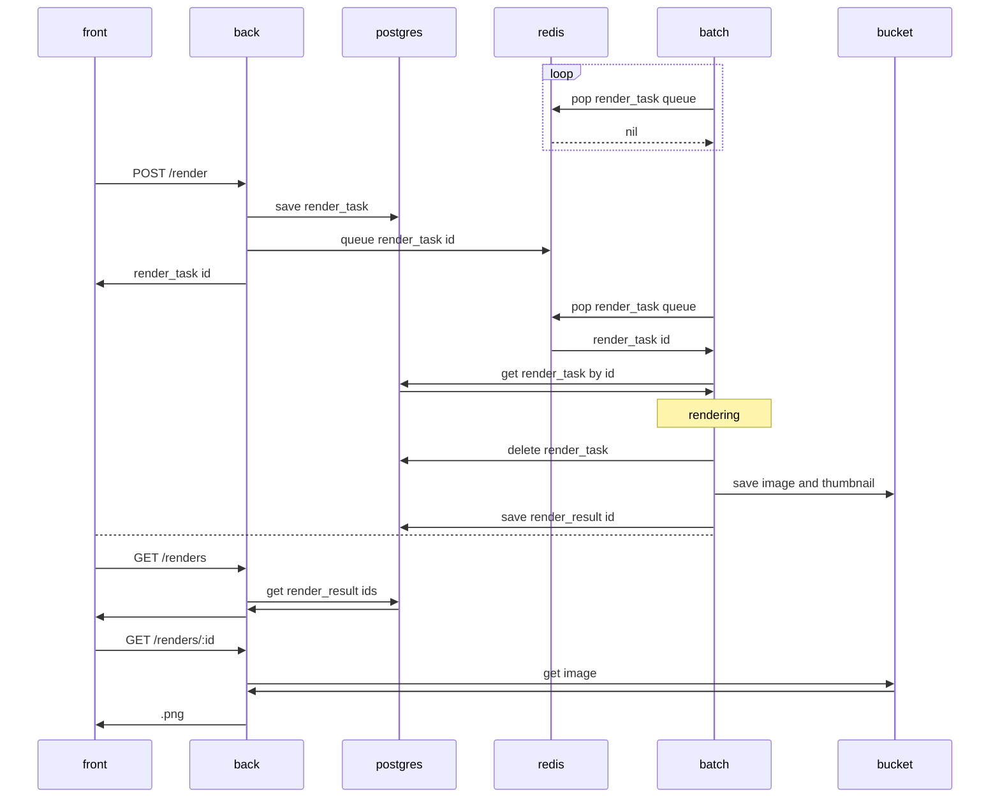
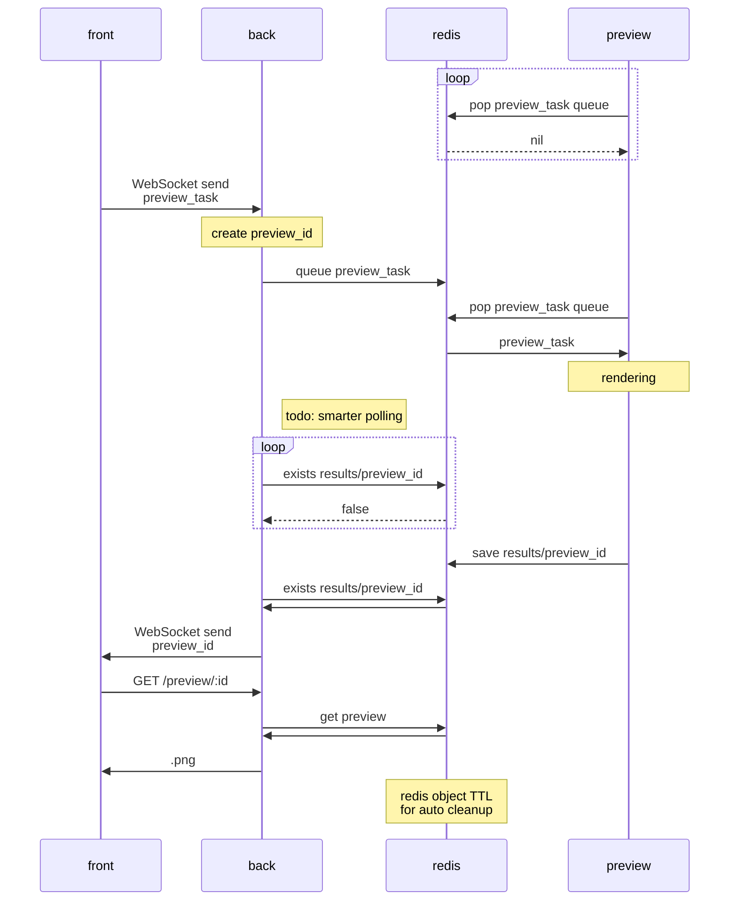

# clovers-service

Frontend + Backend + Batch for [clovers](https://github.com/walther/clovers), the raytracing renderer.

Currently deployed at <https://clovers.fly.dev/>

## clovers-front

Web frontend service, user-facing interface for the application. Written in Typescript using React with [create-react-app](https://github.com/facebook/create-react-app/).

## clovers-back

Web backend service, handles API requests. Written in Rust using [axum](https://github.com/tokio-rs/axum).

## clovers-batch

Batch processing service, handles offline rendering of longer tasks with a high amount of resources available. Written in Rust using [axum](https://github.com/tokio-rs/axum).

## clovers-preview

Preview processing service, handles near-realtime rendering for web UI purposes. Written in Rust using [axum](https://github.com/tokio-rs/axum).

## postgres

Main database for the service. Persistent data.

## redis

Queue service for the preview rendering tasks and results. Ephemeral data.

## bucket

S3 compatible storage for images and thumbnails.

## Usage

Note: first time build times will be slow.

- Development mode: `just dev`
- Production mode: `just prod`

In development mode, hot reload will be available for all services.

## Sequence diagrams

### Full render flow

### Preview render flow

## Work log

| date       | hours | tasks                                                                                                      |
| ---------- | ----- | ---------------------------------------------------------------------------------------------------------- |
| 2022-05-18 | 2     | Planning the architecture. Front + Back + Batch, Redis as a queue                                          |
| 2022-05-19 | 9     | Backend initial scaffolding. Lots of learning with axum + redis library in rust.                           |
| 2022-05-20 | 5     | Backend: more redis stuff. Batch: initial setup. Bunch of refactoring.                                     |
| 2022-05-21 | 3.5   | Add a postgres database, use the postgres database.                                                        |
| 2022-05-22 | 3     | Initial full backend + batch + render pipeline complete. It renders pictures!                              |
| 2022-05-23 | 10    | Frontend: initial basic functionality. You can render scenes from pasted json! Refactoring.                |
| 2022-05-24 | 8     | Frontend: Separate CameraForm. Initial ObjectForm functionality, read-only. Refactoring.                   |
| 2022-05-25 | 8     | Frontend: implement all Objects, Materials, Textures. Fix nested rendering. Input improvements.            |
| 2022-05-26 | 8.5   | Frontend: add ramda, massive refactoring of all input handling. Nested forms now work properly!            |
| 2022-05-27 | 9     | Frontend: fix obj/mat/txt deletion, add new obj/mat/txt addition. Input fixes. Add file import and export. |
| 2022-05-28 | 2     | Frontend: STL file support, initial version w/ 3 hardcoded objects to select from. Small other fixes.      |
| 2022-05-29 | 2     | Engine: fix textures on metal material, fix uv coordinates on rotate objects                               |
| 2022-05-30 | 4     | Frontend: small fixes: expose more rendering opts, add checkbox input, etc. Engine: 80% speedup refactor!  |
| 2022-09-04 | 4     | CI: create an initial pipeline                                                                             |
| 2023-01-08 | 2.5   | Docker: improved local development setup with hot reload + production-like setup                           |
| 2023-01-16 | 1     | Chores: dependency updates, postgres extension setup                                                       |
| 2023-01-17 | 3     | Frontend: refactoring, typescript fixes                                                                    |
| 2023-01-18 | 2     | Frontend: more types, UI improvements                                                                      |
| 2023-01-19 | 3     | Frontend: refactoring: more sensible directory structure, UI improvements, engine update                   |
| 2023-01-21 | 7     | Feature: preview renders. Massive refactorings for enabling this.                                          |
| 2023-01-22 | 1     | Docs: create sequence diagrams for full render and preview workflows. Justfile improvements.               |
| 2023-03-18 | 10    | Feature: WebSockets! Initial impl for previews. Took a few bad turns, debugging took ridiculously long.    |
| 2023-03-19 | 7.5   | Chores: WebSocket fixes and improvements, frontend UI improvements, redis preview expiry, etc              |
| 2023-03-26 | 5     | Feature: WebSocket push for render queue and results! Refactoring.                                         |
| 2023-03-30 | 4     | Chores: reduce memory leaks, engine improvements                                                           |
| 2023-08-30 | 1     | Chores: dependency updates etc                                                                             |
| 2023-09-01 | 5     | Frontend: major restyling, easier to use.                                                                  |
| 2023-09-11 | 7.5   | Feature: Separate materials list, ability to use shared materials between objects.                         |
| 2023-10-18 | 2.5   | Feature: Spectral rendering! This took a month of work on the engine side, now adding it to the service    |
| 2023-10-19 | 3     | Feature: Tooltips for every input field, Color helper block in Materials                                   |
| 2023-10-20 | 2     | Improvement: unify priority object handling between Service and Engine. Add many more loadable examples.   |
| 2023-10-24 | 10    | Improvement: proper production deployment across various services. Lots of debugging involved.             |
| 2023-10-25 | 1     | Minor chores.                                                                                              |
| 2023-10-26 | 5.5   | Improvement: major UI overhaul! New layout, remove flex, grid only. Improved responsiveness & breakpoints. |
| 2023-10-27 | 4.5   | Feature: scene options handling, add One Weekend scene. Improvements: further layout and breakpoint polish |
| 2023-10-29 | 12.5  | Feature: images and thumbnails in S3 compatible storage. Ridiculously long work & debug with the SDK.      |
| 2023-10-30 | 5.5   | Feature: finish the S3 compatible work                                                                     |
| ---        | ---   | ---                                                                                                        |
| total      | 184.0 |                                                                                                            |
